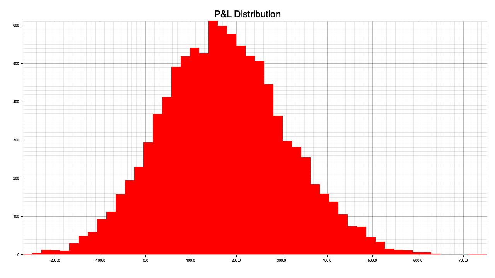

# High Frequency Trading in a Limit Order Book

We are considering a model of a market-maker who trades in a Limit Order Book (LOB) over a finite number of discrete time steps indexed by $t = 0, 1, \dots, T$. In this model, the market-maker provides liquidity by quoting bid and ask prices at each time step $t$, and we model the dynamics of their trading behavior.

*10,000 Simulations of the model*

### Market-Maker's Inventory and Account Value

We begin by defining several key variables:
- Let $W_t \in \mathbb{R}$ denote the market-maker's account value at time $t$.
- Let $I_t \in \mathbb{Z}$ denote the market-maker's inventory of shares at time $t$. Assume that initially $I_0 = 0$, meaning the market-maker starts without any inventory.
- Let $S_t \in \mathbb{R}^{+}$ denote the mid-price of the Limit Order Book at time $t$. We assume that $S_t$ follows a stochastic process.
- Let $P_t^{(b)} \in \mathbb{R}^{+}$ denote the market-maker's bid price at time $t$.
- Let $N_t^{(b)} \in \mathbb{Z}^{+}$ denote the market-maker's quoted bid volume (the number of shares they are willing to buy) at time $t$.
- Let $P_t^{(a)} \in \mathbb{R}^{+}$ denote the market-maker's ask price at time $t$.
- Let $N_t^{(a)} \in \mathbb{Z}^{+}$ denote the market-maker's quoted ask volume (the number of shares they are willing to sell) at time $t$.

### Spreads and Market Dynamics

To describe the market-maker’s quoted prices relative to the mid-price of the LOB, we introduce the following definitions:
- The **bid spread** at time $t$ is given by:
  $$
  \delta_t^{(b)} = S_t - P_t^{(b)}
  $$
  This is the difference between the mid-price and the market-maker’s bid price.
  
- The **ask spread** at time $t$ is given by:
  $$
  \delta_t^{(a)} = P_t^{(a)} - S_t
  $$
  This is the difference between the market-maker’s ask price and the mid-price.

- The **bid-ask spread** is the difference between the ask and bid prices:
  $$
  \delta_t^{(b)} + \delta_t^{(a)} = P_t^{(a)} - P_t^{(b)}
  $$

### Cumulative Transactions

Next, we define random variables to keep track of the cumulative number of shares that the market-maker has transacted with:
- Let $X_t^{(b)} \in \mathbb{Z}_{\geq 0}$ denote the total number of bid shares that have been transacted against (i.e., market buy orders that hit the market-maker’s bid or sell limit orders that match it) by time $t$. This is often referred to as the cumulative "hits" on the bid.
  
- Let $X_t^{(a)} \in \mathbb{Z}_{\geq 0}$ denote the total number of ask shares that have been transacted against (i.e., market sell orders that hit the market-maker’s ask or buy limit orders that match it) by time $t$. This is often referred to as the cumulative "lifts" on the ask.

### Trading Account Balance Dynamics

The dynamics of the market-maker’s account value $W_t$ over time depend on the transacted bid and ask shares. Specifically, the trading account balance equation for time $t = 0, 1, \dots, T-1$ is given by:

$$
W_{t+1} = W_t + P_t^{(a)} \cdot \left(X_{t+1}^{(a)} - X_t^{(a)}\right) - P_t^{(b)} \cdot \left(X_{t+1}^{(b)} - X_t^{(b)}\right)
$$

Here, $P_t^{(a)} \cdot \left(X_{t+1}^{(a)} - X_t^{(a)}\right)$ represents the revenue from selling shares at the ask price, and $P_t^{(b)} \cdot \left(X_{t+1}^{(b)} - X_t^{(b)}\right)$ represents the cost of buying shares at the bid price.

### Inventory Dynamics

Since the market-maker starts with zero inventory ($I_0 = 0$), the inventory $I_t$ at any time $t$ is given by the difference between the number of bid and ask shares transacted up to time $t$:
$$
I_t = X_t^{(b)} - X_t^{(a)}
$$

This means that the inventory increases when more bid shares are transacted (i.e., the market-maker buys shares) and decreases when more ask shares are transacted (i.e., the market-maker sells shares).

### Objective: Maximizing Expected Utility

The market-maker’s objective is to maximize the expected utility of the terminal account value, which includes both the cash holdings (account value $W_T$) and the value of the final inventory (which is marked-to-market at the mid-price $S_T$). Specifically, the market-maker seeks to maximize the following:

$$
\mathbb{E}\left[U\left(W_T + I_T \cdot S_T\right)\right]
$$

where $U(\cdot)$ is a concave utility function. A commonly used utility function is the CARA (Constant Absolute Risk Aversion) utility function:
$$
U(x) = -e^{-\gamma x}
$$
where $\gamma > 0$ is a risk-aversion parameter.

### Problem Formulation as a Markov Decision Process

This optimization problem can be formulated as a discrete-time, finite-horizon Markov Decision Process (MDP). The state of the system at time $t$ is described by the tuple $\left(S_t, W_t, I_t\right)$, and the action taken by the market-maker involves setting the bid and ask prices ($P_t^{(b)}, P_t^{(a)}$) and the corresponding bid and ask volumes ($N_t^{(b)}, N_t^{(a)}$).

At each time step $t = 0, 1, \dots, T-1$, the sequence of events is as follows:
1. Observe the state $\left(S_t, W_t, I_t\right)$.
2. Set the bid price $P_t^{(b)}$, ask price $P_t^{(a)}$, and the associated volumes $N_t^{(b)}, N_t^{(a)}$.
3. Randomly observe the number of bid shares that are hit, i.e., $X_{t+1}^{(b)} - X_t^{(b)}$.
4. Randomly observe the number of ask shares that are lifted, i.e., $X_{t+1}^{(a)} - X_t^{(a)}$.
5. Update the account value $W_t$ and inventory $I_t$.
6. Evolve the mid-price $S_t$ according to a stochastic process (e.g., Brownian motion).
7. Receive a reward, which is zero for all time steps except the terminal time $T$, where the reward is the utility of the terminal wealth:

$$
R_{t+1} = 
\begin{cases} 
0 & \text{for } 1 \leq t+1 \leq T-1 \\ 
U\left(W_T + I_T \cdot S_T\right) & \text{for } t+1 = T
\end{cases}
$$

### Optimal Policy

The goal is to find an optimal policy $\pi^* = \left(\pi_0^*, \pi_1^*, \dots, \pi_{T-1}^*\right)$, where the policy at each time step $t$ maps the state $\left(S_t, W_t, I_t\right)$ to the optimal action $\left(P_t^{(b)}, N_t^{(b)}, P_t^{(a)}, N_t^{(a)}\right)$. The optimal policy maximizes the expected reward:

$$
\mathbb{E}\left[\sum^T R_t\right] = \mathbb{E}\left[U\left(W_T + I_T \cdot S_T\right)\right]
$$

### Continuous-Time Formulation

A continuous-time version of this problem was formulated by Avellaneda and Stoikov (2008). In this formulation, the bid and ask volumes are modeled using Poisson processes with rates $\lambda_t^{(b)}$ and $\lambda_t^{(a)}$ that depend on the bid and ask spreads:
$$
dX_t^{(b)} \sim \text{Poisson}\left(\lambda_t^{(b)} \cdot dt\right), \quad dX_t^{(a)} \sim \text{Poisson}\left(\lambda_t^{(a)} \cdot dt\right)
$$

where:
$$
\lambda_t^{(b)} = f^{(b)}\left(\delta_t^{(b)}\right), \quad \lambda_t^{(a)} = f^{(a)}\left(\delta_t^{(a)}\right)
$$
for decreasing functions $f^{(b)}(\cdot)$ and $f^{(a)}(\cdot)$. These functions represent the market's response to the market-maker's bid and ask spreads: larger spreads result in fewer transactions.

### Mid-Price Dynamics and Utility

The mid-price $S_t$ is assumed to follow a scaled Brownian motion:
$$
dS_t = \sigma \cdot dz_t
$$
where $\sigma$ is the volatility of the mid-price and $dz_t$ represents increments of a standard Brownian motion.

The market-maker's objective is to maximize the expected utility of terminal wealth, where the utility function is assumed to be of CARA form:
$$
U(x) = -e^{-\gamma x}
$$
with risk-aversion parameter $\gamma > 0$.

### Hamilton-Jacobi-Bellman (HJB) Equation

The continuous-time problem can be expressed using the Hamilton-Jacobi-Bellman (HJB) equation. The optimal value function $V^*(t, S_t, W_t, I_t)$ represents the maximum expected utility starting at time $t$ with state variables $S_t$, $W_t$, and $I_t$. The HJB equation for this problem is:

$$
\max_{\delta_t^{(b)}, \delta_t^{(a)}} \left\{ \frac{\partial V^*}{\partial t} + \frac{\sigma^2}{2} \cdot \frac{\partial^2 V^*}{\partial S_t^2} + \lambda_t^{(b)} \cdot \left(V^*(t, S_t, W_t - S_t + \delta_t^{(b)}, I_t + 1) - V^*(t, S_t, W_t, I_t)\right) + \lambda_t^{(a)} \cdot \left(V^*(t, S_t, W_t + S_t + \delta_t^{(a)}, I_t - 1) - V^*(t, S_t, W_t, I_t)\right) \right\} = 0
$$

with the terminal condition:
$$
V^ *(T, S_T, W_T, I_T) = -e^ {-\gamma \cdot (W_T + I_T \cdot S_T)}
$$

Solving the HJB equation provides the optimal spreads $\delta_t^{(b)}$ and $\delta_t^{(a)}$, which determine the bid and ask prices for the market-maker.

### Solving the HJB Equation

To solve the Hamilton-Jacobi-Bellman (HJB) equation, we begin by making an educated guess about the functional form of the value function $V^*(t, S_t, W_t, I_t)$. Since the utility function is of the form $U(x) = -e^{-\gamma x}$, a reasonable assumption is that the optimal value function can be expressed as:

$$
V^*(t, S_t, W_t, I_t) = -e^{-\gamma \cdot \left(W_t + \theta(t, S_t, I_t)\right)}
$$

where $\theta(t, S_t, I_t)$ is an unknown function that we will solve for. Substituting this form into the HJB equation allows us to simplify the problem and reduce it to a Partial Differential Equation (PDE) for $\theta(t, S_t, I_t)$.

#### Substituting into the HJB Equation

Substituting $V^*(t, S_t, W_t, I_t) = -e^{-\gamma \cdot (W_t + \theta(t, S_t, I_t))}$ into the HJB equation, we first differentiate $V^*$ with respect to $t$, $S_t$, and the other variables. Let’s outline the steps of substitution:

1. **Time Derivative**:
   $$
   \frac{\partial V^*}{\partial t} = \gamma \cdot e^{-\gamma \cdot \left(W_t + \theta(t, S_t, I_t)\right)} \cdot \frac{\partial \theta}{\partial t}
   $$

2. **Price Derivatives**:
   $$
   \frac{\partial V^*}{\partial S_t} = \gamma \cdot e^{-\gamma \cdot \left(W_t + \theta(t, S_t, I_t)\right)} \cdot \frac{\partial \theta}{\partial S_t}
   $$
   $$
   \frac{\partial^2 V^*}{\partial S_t^2} = \gamma \cdot e^{-\gamma \cdot \left(W_t + \theta(t, S_t, I_t)\right)} \cdot \frac{\partial^2 \theta}{\partial S_t^2} - \gamma^2 \cdot e^{-\gamma \cdot \left(W_t + \theta(t, S_t, I_t)\right)} \cdot \left(\frac{\partial \theta}{\partial S_t}\right)^2
   $$

3. **Inventory and Spread Updates**:
   The bid and ask transaction terms from the Poisson processes also modify the function $\theta$. The changes in inventory are captured by the shifts in $\theta$ when the market-maker buys (increases $I_t$) or sells (decreases $I_t$). Specifically, the updates for the bid and ask spreads affect the function $\theta$ as follows:

   - For a hit on the bid, the inventory increases by 1 and the cash decreases by $S_t - \delta_t^{(b)}$. Thus:
     $$
     V^*(t, S_t, W_t - S_t + \delta_t^{(b)}, I_t + 1) = -e^{-\gamma \cdot \left(W_t - S_t + \delta_t^{(b)} + \theta(t, S_t, I_t + 1)\right)}
     $$
     - For a lift on the ask, the inventory decreases by 1 and the cash increases by $S_t + \delta_t^{(a)}$. Thus:
     $$
     V^*(t, S_t, W_t + S_t + \delta_t^{(a)}, I_t - 1) = -e^{-\gamma \cdot \left(W_t + S_t + \delta_t^{(a)} + \theta(t, S_t, I_t - 1)\right)}
     $$

4. **HJB Equation Substitution**:
   Plugging these derivatives into the HJB equation and simplifying, we obtain the following PDE for $\theta(t, S_t, I_t)$:

   $$
   \frac{\partial \theta}{\partial t} + \frac{\sigma^2}{2} \cdot \left(\frac{\partial^2 \theta}{\partial S_t^2} - \gamma \cdot \left(\frac{\partial \theta}{\partial S_t}\right)^2\right) + \max_{\delta_t^{(b)}} \left\{\frac{f^{(b)}\left(\delta_t^{(b)}\right)}{\gamma} \cdot \left(1 - e^{-\gamma \cdot \left(\delta_t^{(b)} - S_t + \theta(t, S_t, I_t+1) - \theta(t, S_t, I_t)\right)}\right)\right\}
   $$

   $$
   + \max_{\delta_t^{(a)}} \left\{\frac{f^{(a)}\left(\delta_t^{(a)}\right)}{\gamma} \cdot \left(1 - e^{-\gamma \cdot \left(\delta_t^{(a)} + S_t + \theta(t, S_t, I_t-1) - \theta(t, S_t, I_t)\right)}\right)\right\} = 0
   $$

   with the terminal condition:
   $$
   \theta(T, S_T, I_T) = I_T \cdot S_T
   $$

### Maximizing the Spreads

At this stage, we maximize the two expressions involving $\delta_t^{(b)}$ and $\delta_t^{(a)}$. These represent the market-maker’s optimal bid and ask spreads, respectively. The expressions inside the maximizations involve functions $f^{(b)}(\delta_t^{(b)})$ and $f^{(a)}(\delta_t^{(a)})$, which model the likelihood of market participants hitting or lifting the market-maker’s bid or ask, depending on how far the prices are from the mid-price.

By solving these maximizations, we can find the optimal bid and ask spreads, $\delta_t^{(b)^*}$ and $\delta_t^{(a)^*}$, respectively. The maximization equations are typically solved by differentiating the respective terms with respect to $\delta_t^{(b)}$ and $\delta_t^{(a)}$, and setting the derivatives to zero.

For the bid spread, we solve:
$$
\frac{\partial}{\partial \delta_t^{(b)}} \left\{ \frac{f^{(b)}\left(\delta_t^{(b)}\right)}{\gamma} \cdot \left(1 - e^{-\gamma \cdot \left(\delta_t^{(b)} - S_t + \theta(t, S_t, I_t+1) - \theta(t, S_t, I_t)\right)}\right)\right\} = 0
$$
and for the ask spread:
$$
\frac{\partial}{\partial \delta_t^{(a)}} \left\{ \frac{f^{(a)}\left(\delta_t^{(a)}\right)}{\gamma} \cdot \left(1 - e^{-\gamma \cdot \left(\delta_t^{(a)} + S_t + \theta(t, S_t, I_t-1) - \theta(t, S_t, I_t)\right)}\right)\right\} = 0
$$

#### Bid Spread Solution:
Differentiating and solving yields an implicit equation for the optimal bid spread $\delta_t^{(b)^*}$:
$$
\delta_t^{(b)^*} = S_t - Q_t^{(b)} + \frac{1}{\gamma} \cdot \log\left(1 + \gamma \cdot \frac{f^{(b)}(\delta_t^{(b)^*})}{\frac{\partial f^{(b)}}{\partial \delta_t^{(b)}}(\delta_t^{(b)^*})}\right)
$$

#### Ask Spread Solution:
Similarly, for the optimal ask spread $\delta_t^{(a)^*}$, we get:
$$
\delta_t^{(a)^*} = Q_t^{(a)} - S_t + \frac{1}{\gamma} \cdot \log\left(1 + \gamma \cdot \frac{f^{(a)}(\delta_t^{(a)^*})}{\frac{\partial f^{(a)}}{\partial \delta_t^{(a)}}(\delta_t^{(a)^*})}\right)
$$

These are implicit equations for $\delta_t^{(b)^*}$ and $\delta_t^{(a)^*}$, which can be solved numerically.

### Indifference Prices and Spreads

To build further intuition, we define the **Indifference Bid Price** $Q_t^{(b)}$ and **Indifference Ask Price** $Q_t^{(a)}$:
- **Indifference Bid Price**: The price at which the market-maker is indifferent between keeping their inventory or buying one more share:
  $$
  Q_t^{(b)} = \theta(t, S_t, I_t + 1) - \theta(t, S_t, I_t)
  $$
  
- **Indifference Ask Price**: The price at which the market-maker is indifferent between keeping their inventory or selling one share:
  $$
  Q_t^{(a)} = \theta(t, S_t, I_t) - \theta(t, S_t, I_t - 1)
  $$

The **Indifference Mid Price** is then given by the average of the indifference bid and ask prices:
$$
Q_t^{(m)} = \frac{Q_t^{(b)} + Q_t^{(a)}}{2}
$$
which represents the market-maker's perception of the fair price adjusted for their inventory risk.

### Simplifying the HJB Equation

Substituting these expressions for $Q_t^{(b)}$ and $Q_t^{(a)}$ back into the HJB equation leads to the following PDE for $\theta(t, S_t, I_t)$:
$$
\frac{\partial \theta}{\partial t} + \frac{\sigma^2}{2} \cdot \left(\frac{\partial^2 \theta}{\partial S_t^2} - \gamma \cdot \left(\frac{\partial \theta}{\partial S_t}\right)^2\right) + \frac{f^{(b)}(\delta_t^{(b)^*})}{\gamma} \cdot \left(1 - e^{-\gamma \cdot (\delta_t^{(b)^*} - S_t + Q_t^{(b)})}\right) + \frac{f^{(a)}(\delta_t^{(a)^*})}{\gamma} \cdot \left(1 - e^{-\gamma \cdot (\delta_t^{(a)^*} + S_t + Q_t^{(a)})}\right) = 0
$$

### Approximating the Solution

To simplify further, we make assumptions about the form of the transaction rate functions $f^{(b)}(\delta)$ and $f^{(a)}(\delta)$. A common choice is to assume exponential forms for these functions:
$$
f^{(b)}(\delta) = c \cdot e^{-k \cdot \delta}, \quad f^{(a)}(\delta) = c \cdot e^{-k \cdot \delta}
$$
where $c > 0$ and $k > 0$ are constants. Under these assumptions, the expressions for the optimal bid and ask spreads become:

$$
\delta_t^{(b)^*} = S_t - Q_t^{(b)} + \frac{1}{\gamma} \cdot \log\left(1 + \frac{\gamma}{k}\right)
$$
$$
\delta_t^{(a)^*} = Q_t^{(a)} - S_t + \frac{1}{\gamma} \cdot \log\left(1 + \frac{\gamma}{k}\right)
$$

### Final Solution for Optimal Spreads and Prices

The final expressions for the optimal bid and ask prices, incorporating both the inventory adjustment and risk-aversion effects, are given by:
$$
P_t^{(b)^*} = S_t - \delta_t^{(b)^*}, \quad P_t^{(a)^*} = S_t + \delta_t^{(a)^*}
$$

The optimal bid-ask spread is then:
$$
\delta_t^{(b)^*} + \delta_t^{(a)^*} = \gamma \cdot \sigma^2 \cdot (T - t) + \frac{2}{\gamma} \cdot \log\left(1 + \frac{\gamma}{k}\right)
$$

Thus, the market-maker adjusts their bid and ask prices based on their current inventory and the time remaining until the terminal period $T$.

